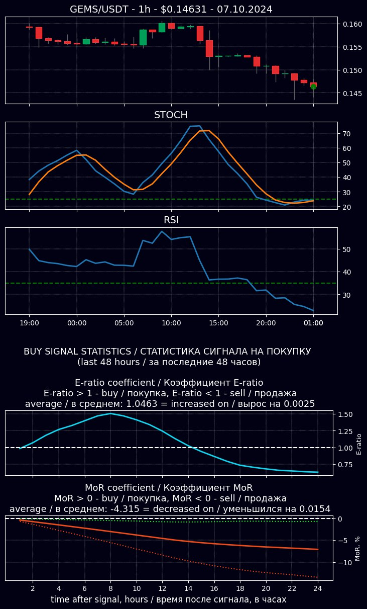

# Cryptocurrency Signal Bot with Indicators and Profitability Statistics

## Signal module

Signal module analyzes indicators from 2500+ trading pairs from 8 different cryptoexchanges and sends signal to corresponding topic of the Telegram chat if there is a combination of indicators (e.g. STOCH + RSI) that signalizes about high probability of signal moving to one or another side.

Signals from each combination are sended to corresponding chat topic. Buy and sell signals are sent to different topics, so users can enable notifications only for signal combinations and trade sides they are interested in.

Besides signal and indicators visualization bot also writes statistics about similar signals, that were sent from different trade pairs in last 24-48 hours. You can read more information about metrics below.

Bot also sends the list of exchanges where the corresponding ticker is traded and links to TradingView site for ticker/USDT and ticker/BTC pairs.

Example of signal:

Example of working bot can be found at https://t.me/crypto_signal_bot_group

### Supported exchanges:
- Binance
- Binance Futures
- OKEX
- OKEX Swap
- Bybit
- Bybit Perpetual
- MEXC
- MEXC Futures

### Supported indicators:
- Pattern – looks for the most popular candle patterns (Head & Shoulders, Double Bottom, Double Top, Ascending and Descending Triangle, High-Low-Higher, Low-High-Lower, Swing)  and than looks for combination of two bull/bear candles that confirms this pattern. Timeframe is 1 hour.
- RSI 14, low/higher border - 35/65. Activates for buy signals when indicator is below low border and for sell signals when indicator is above high border. Timeframe is 1 hour.
- Stochastic 9/7/3, low/higher border - 25/75. Activates for buy signals when indicator is below low border and for sell signals when indicator is above high border. Timeframe is 1 hour.
- Trend – looks for ascending/descending trend with linear regression methon (period is 20-30 candles). Activates for buy signals when trend is ascending and for sell signals when trend is descending. Timeframe is 4 hours.
- MACD 12/26/9 - activates for buy signals if fast line crosses slow line in down up direction and for sell signals if fast line crosses slow line in top down direction. Timeframe is 4 hours.
- Pump-Dump – looks for the big price moves that are bigger than 99% of all other moves. Timeframe is 1 hour.
- High Volume – looks for the high trade volume that is bigger than 99% of all other trade volumes. Timeframe is 1 hour.

### Indicator combinations.
For signal search the following indicator combinations are used (each combination and each trade side has it’s own chat topic):
- Pattern + Trend
- Stochastic + RSI
- Stochastic + RSI + Trend
- MACD
- Pump-Dump + Trend
- High Volume

### Metrics and statistics.
For statistics measure two metrics are used:

- E-ratio (Edge ratio) coefficient – so called price skew or ratio between maximum price deviation in direction in favor of the trade side (MFE - Maximum Favorable Excursion) and maximum price deviation in direction against trade side (MAE - Maximum Adversarial Excursion), for the time that passed from the moment of trade to the current moment.

E-ratio = MFE/MAE.
E-ratio > 1 – skew is in favor of the trade side
E-ratio < 1 – skew is against the trade side

- MoR Coefficient (Measure of Return) – is measured as difference between current price and price at the moment of the signal, and that difference is divided by the price at the moment of the signal.

MoR = (Current_price – Signal_price) /  Signal_price * 100. E.g. it’s difference between current price and signal price in percents. Both prices are smoothed by Moving Average with period 30, so that metrics doesn’t depend on sharp price moves as E-ratio does.
MoR > 0 – buy
MoR < 0 – sell
Both metrics are measured for 24 or 96 hours after signal (it depend on pattern). Then statistics for each signal for the last 24/96 hours is averaged and plotted.

## Trading Module

Trading Module is activated when specific combination of indicators (STOCH + RSI) appears at specific time on specific exchange (Bybit). It gathers corresponding ticker data (price history, volume history, funding rate, BTC dominance, etc.) and makes prediction if the price of that ticker will rise or fall. If model confidence level is more than a threshold -
a trade is opened. Model that is used for prediction is LightGBM. Module can be found at `ml` folder.

# Configuration

API keys for access to exchanges, Telegram and TradingView are stored in .env file.

.env file also controls the bot behaviour through the ENV variable

Possible values of ENV variable:

- `1h_4h` - working mode

- `debug` - debug mode, is used for quick check of bot functionality and searching of the errors

- `test` - mode that is used for the test running

- `optimize` - mode that is used to find out the optimal indicator parameters

Example of .env file configuration can be found in `.env_example` file

All other settings are stored at `config` folder in `config_<ENV_variable_value>.json` file.

# Requirements

* python `3.10`
* pandas `1.4.3`
* numpy `1.23.2`
* ta-lib `0.4.19`
* python-binance `1.0.16`
* pybit `5.6.2`
* python-dotenv `0.20.0`
* jupyter `1.0.0`
* mplfinance `0.12.9b1`
* matplotlib `3.5.3`
* pytest `7.1.2`
* pytest-mock `3.12.0`
* freezegun `1.2.2`
* python-telegram-bot `21.1`
* proplot `0.9.5`
* requests `2.28.1`
* joblib `1.2.0`
* lightgbm `4.0.0`

# Install and Run

### Build Docker image

`docker build . -t sigbot`

### Run Docker container

`docker run --rm -v ${PWD}/:/sigbot sigbot`

### Stop Docker container

`docker stop $(docker ps -q --filter ancestor=sigbot)`

### Delete all stopped bot containers

`docker rm $(docker ps -a --filter ancestor=sigbot)`
